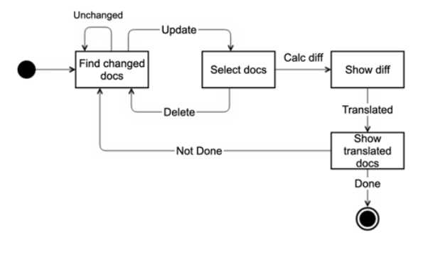
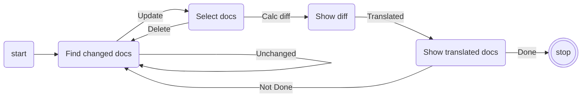

# I18N-For-Beginners #

Internationalization for Microsoft Beginner series([Web-Dev-For-Beginners](https://github.com/devrel-kr/Web-Dev-For-Beginners) & [ML-For-Beginners](https://github.com/devrel-kr/ML-For-Beginners)) and other documents.

* **github pages** : [devrel-kr.github.io/i18n-for-beginners//](devrel-kr.github.io/i18n-for-beginners//)
* **Target Branch**

    * **Original** : [microsoft/Web-Dev-For-Beginners](https://github.com/microsoft/Web-Dev-For-Beginners)

    * **Korean** : [devrel-kr/Web-Dev-For-Beginners](https://github.com/devrel-kr/Web-Dev-For-Beginners)

    
---

## Flow Chart ##

   

## API ##
* **[Azure Translator API](https://www.microsoft.com/ko-kr/translator/business/translator-api/)** : It translates the added changes in advance

## GitHub Secrets ##

Following GitHub Secrets are required for CI/CD :

* `USER_EMAIL`: Setting your commit Email address 

* `USER_NAME`: Setting your commit User Name 

* `TRANSLATEAPI`: Key to API used for Draft translation

## Development Tools ##

#### Prerequisites for Local Development ####

* [Visual Studio Code](https://code.visualstudio.com/?WT.mc_id=dotnet-58531-juyoo)
* [Github Action](https://pages.github.com/)
* [Jekyll](https://jekyllrb-ko.github.io/)
* [Github Pages](https://docs.github.com/en/actions)

---

## LICENSE ##

Copyright (c) Microsoft Corporation. All rights reserved.

Licensed under the [MIT](https://github.com/devrel-kr/I18N-For-Beginners/blob/main/LICENSE) license.