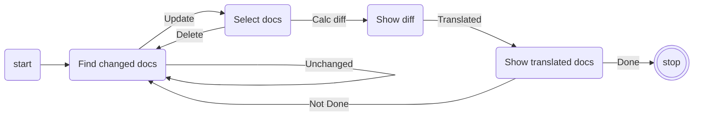

<<<<<<< HEAD
# I18N-For-Beginners #


Internationalization for Microsoft Beginner series([Web-Dev-For-Beginners](https://github.com/devrel-kr/Web-Dev-For-Beginners) & [ML-For-Beginners](https://github.com/devrel-kr/ML-For-Beginners)) and other documents.

* **github pages** : [devrel-kr.github.io/i18n-for-beginners//](devrel-kr.github.io/i18n-for-beginners//)
* **Target Branch**

    * **Original** : [microsoft/Web-Dev-For-Beginners](https://github.com/microsoft/Web-Dev-For-Beginners)

    * **Korean** : [devrel-kr/Web-Dev-For-Beginners](https://github.com/devrel-kr/Web-Dev-For-Beginners)

    
---

## Flow Chart ##



   

## API ##
* **[Azure Translator API](https://www.microsoft.com/ko-kr/translator/business/translator-api/)** : It translates the added changes in advance


## GitHub Secrets ##

Following GitHub Secrets are required for CI/CD :

* `USER_EMAIL`: Setting your commit Email address 

* `USER_NAME`: Setting your commit User Name 

* `TRANSLATEAPI`: Key to API used for Draft translation


## Development Tools ##

#### Prerequisites for Local Development ####

* [Visual Studio Code](https://code.visualstudio.com/?WT.mc_id=dotnet-58531-juyoo)
* [Github Action](https://pages.github.com/)
* [Jekyll](https://jekyllrb-ko.github.io/)
* [Github Pages](https://docs.github.com/en/actions)


---

## LICENSE ##

Copyright (c) Microsoft Corporation. All rights reserved.

Licensed under the [MIT](https://github.com/devrel-kr/I18N-For-Beginners/blob/main/LICENSE) license.
=======
# Kiko Now

*Read this in other languages: [English](README.md), [한국어](README.ko.md).*

**Jekyll** is a static site generator that's perfect for GitHub hosted blogs ([Jekyll Repository](https://github.com/jekyll/jekyll))

**Kiko Now** is a Jekyll theme based on **[Jekyll Now](https://github.com/barryclark/jekyll-now)**, following the philosophy of **Jekyll Now**, which makes it easier to create your Jekyll blog, by eliminating a lot of the up front setup.


## Quick Start

### Step 1) Fork Jekyll Now to your User Repository

Fork this repo, then rename the repository to yourgithubusername.github.io.

Your Jekyll blog will often be viewable immediately at <https://yourgithubusername.github.io> (if it's not, you can often force it to build by completing step 2)

### Step 2) Customize and view your site

Enter your site name, description, avatar and many other options by editing the _config.yml file. You can easily turn on Google Analytics tracking, Disqus commenting and social icons here too.

Making a change to _config.yml (or any file in your repository) will force GitHub Pages to rebuild your site with jekyll. Your rebuilt site will be viewable a few seconds later at <https://yourgithubusername.github.io> - if not, give it ten minutes as GitHub suggests and it'll appear soon

There are 3 different ways that you can make changes to your blog's files:

1. Edit files within your new username.github.io repository in the browser at GitHub.com (shown below).
2. Use a third party GitHub content editor, like [Prose by Development Seed](http://prose.io). It's optimized for use with Jekyll making markdown editing, writing drafts, and uploading images really easy.
3. Clone down your repository and make updates locally, then push them to your GitHub repository.


### Step 3) Publish your first blog post

Edit `/_posts/2017-10-08-hello-world.md` to publish your first blog post. This [Markdown Cheatsheet](http://www.jekyllnow.com/Markdown-Style-Guide/) might come in handy.


You can add additional posts in the browser on GitHub.com too! Just hit the + icon in `/_posts/` to create new content. Just make sure to include the [front-matter](http://jekyllrb.com/docs/frontmatter/) block at the top of each new blog post and make sure the post's filename is in this format: year-month-day-title.md

#### Frontmatter
```
---
layout: post
title: "post title"
tags: [tag1, tag2, tag3]
comments: true
---
```

## Local Development

1. Install Jekyll and plug-ins in one fell swoop. `gem install github-pages` This mirrors the plug-ins used by GitHub Pages on your local machine including Jekyll, Sass, etc.
2. Clone down your fork `git clone https://github.com/yourusername/yourusername.github.io.git`
3. Serve the site and watch for markup/sass changes `jekyll serve`
4. View your website at http://127.0.0.1:4000/
5. Commit any changes and push everything to the master branch of your GitHub user repository. GitHub Pages will then rebuild and serve your website.

## Questions?

[Open an Issue](https://github.com/aweekj/kiko-now/issues/new) and let's chat!
>>>>>>> eab4e2d0ba948acce4436e00f5883eb16f2cd007
